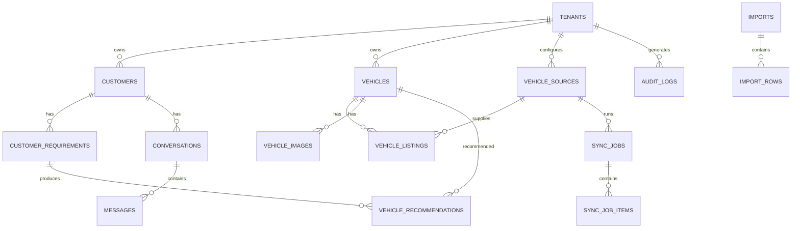

# Car Dealer SaaS — SQL Server Schema & ERD Specification

**Implementation specification**

> **Conversion note.** This is a faithful Markdown conversion of
> `Car_Dealer_SaaS_SQL_Schema_and_ERD_Specification(1).docx`, which remains in the repository as
> the signed-off original. This copy is the working source of truth because it is diffable and
> greppable in git. If the two disagree, the `.docx` wins until this file is corrected.
>
> **This document describes the schema as originally specified.** Seven decisions taken since
> then change parts of it — most importantly `Vehicles.TenantId` becomes nullable. Read
> [`04-schema-delta.md`](04-schema-delta.md) alongside this file; where the two conflict, the
> delta is authoritative and says so explicitly.

---

## 1. Database objectives

Normalized multi-tenant SQL Server schema supporting vehicle aggregation, CRM, conversations, AI
recommendations, imports, synchronization, integrations, auditing and future analytics.

## 2. Conventions

- SQL Server + EF Core migrations.
- UTC `datetime2(3)`.
- `nvarchar` for multilingual text; `decimal(18,2)` for money.
- `TenantId` on all tenant-owned tables.
- Business records use status/soft-delete patterns where history matters.
- Public identifiers may use `uniqueidentifier`; internal transactional keys may use `bigint`
  identity.
- Foreign keys, unique constraints and indexes are mandatory.

## 3. Core tables and columns

### Tenants
`Id` PK; `PublicId` uniqueidentifier; `Name`; `Slug` UNIQUE; `Status`; `DefaultCurrencyCode`;
`DefaultCountryCode`; `CreatedAtUtc`; `UpdatedAtUtc`.

### Users
`Id` PK; `PublicId`; `Email` UNIQUE; `PasswordHash`; `FirstName`; `LastName`; `Phone`; `Status`;
`LastLoginAtUtc`; `CreatedAtUtc`; `UpdatedAtUtc`.

### Roles
`Id` PK; `Name` UNIQUE; `Description`.

### UserRoles
`UserId` FK; `RoleId` FK; `TenantId` FK; composite PK.

### Customers
`Id` PK; `TenantId` FK; `PublicId`; `FirstName`; `LastName`; `Phone`; `Email`; `CountryCode`;
`City`; `PreferredLanguage`; `Status`; `LeadSource`; `AssignedUserId` FK; `Notes`; `CreatedAtUtc`;
`UpdatedAtUtc`.

### CustomerRequirements
`Id` PK; `TenantId`; `CustomerId` FK; `Name`; `MinYear`; `MaxYear`; `MinPrice`; `MaxPrice`;
`CurrencyCode`; `Make`; `Model`; `Variant`; `MinMileage`; `MaxMileage`; `Transmission`;
`FuelType`; `BodyType`; `ExteriorColor`; `DestinationCountryCode`; `DestinationCity`;
`RawRequirementText`; `Status`; `CreatedAtUtc`; `UpdatedAtUtc`.

### VehicleSources
`Id` PK; `TenantId` nullable for shared sources; `Name`; `Code`; `ProviderType`; `SourceType`;
`BaseUrl`; `IsShared`; `IsActive`; `CreatedAtUtc`; `UpdatedAtUtc`.

### VehicleSourceConfigurations
`Id` PK; `TenantId`; `VehicleSourceId` FK; `ConfigurationJson`; `CredentialReference`;
`SyncEnabled`; `SyncIntervalMinutes`; `LastSuccessAtUtc`; `LastFailureAtUtc`; `LastError`;
`CreatedAtUtc`; `UpdatedAtUtc`.

### Vehicles
`Id` PK; `TenantId`; `PublicId`; `Make`; `Model`; `Variant`; `ModelYear`; `BodyType`; `Engine`;
`EngineDisplacementCc`; `FuelType`; `Transmission`; `Drivetrain`; `Mileage`; `MileageUnit`;
`ExteriorColor`; `InteriorColor`; `ChassisNumber`; `Vin`; `Condition`; `Status`; `CanonicalHash`;
`CreatedAtUtc`; `UpdatedAtUtc`.

### VehicleListings
`Id` PK; `TenantId`; `VehicleId` FK; `VehicleSourceId` FK; `ExternalListingId`; `SourceUrl`;
`SourceStatus`; `Price`; `CurrencyCode`; `PriceType`; `LocationCountryCode`; `LocationCity`;
`RawPayload`; `FirstSeenAtUtc`; `LastSeenAtUtc`; `LastSyncedAtUtc`; `IsActive`; `CreatedAtUtc`;
`UpdatedAtUtc`.

### VehicleImages
`Id` PK; `TenantId`; `VehicleId` FK; `ImageUrl`; `SortOrder`; `ImageType`; `SourceImageId`;
`CreatedAtUtc`.

### VehicleListingImages
`VehicleListingId` FK; `VehicleImageId` FK; composite PK.

### Conversations
`Id` PK; `TenantId`; `CustomerId` FK; `Channel`; `ExternalConversationId`; `Subject`; `Status`;
`AssignedUserId` FK; `LastMessageAtUtc`; `CreatedAtUtc`; `UpdatedAtUtc`.

### Messages
`Id` PK; `TenantId`; `ConversationId` FK; `ExternalMessageId`; `Direction`; `SenderType`;
`SenderExternalId`; `MessageType`; `Body`; `MediaJson`; `ProviderStatus`; `SentAtUtc`;
`ReceivedAtUtc`; `CreatedAtUtc`.

### Tasks
`Id` PK; `TenantId`; `CustomerId` FK; `ConversationId` FK; `AssignedUserId` FK; `Title`;
`Description`; `DueAtUtc`; `Priority`; `Status`; `CompletedAtUtc`; `CreatedAtUtc`; `UpdatedAtUtc`.

### VehicleRecommendations
`Id` PK; `TenantId`; `CustomerRequirementId` FK; `VehicleId` FK; `Score`; `Rank`; `ReasonsJson`;
`RecommendationSource`; `AIRequestId` FK nullable; `Status`; `CreatedAtUtc`.

### AIRequests
`Id` PK; `TenantId`; `Provider`; `Model`; `Operation`; `InputHash`; `InputMetadataJson`;
`OutputMetadataJson`; `TokenUsageJson`; `Cost`; `Status`; `CreatedAtUtc`; `CompletedAtUtc`.

### Imports
`Id` PK; `TenantId`; `ImportType`; `FileName`; `StorageReference`; `Status`; `TotalRows`;
`SucceededRows`; `FailedRows`; `StartedAtUtc`; `CompletedAtUtc`; `CreatedByUserId` FK;
`CreatedAtUtc`.

### ImportRows
`Id` PK; `ImportId` FK; `RowNumber`; `Status`; `RawDataJson`; `ErrorMessage`; `EntityId`;
`CreatedAtUtc`.

### SyncJobs
`Id` PK; `TenantId`; `VehicleSourceId` FK; `JobType`; `Status`; `StartedAtUtc`; `CompletedAtUtc`;
`TotalRecords`; `CreatedRecords`; `UpdatedRecords`; `FailedRecords`; `ErrorMessage`;
`CreatedAtUtc`.

### SyncJobItems
`Id` PK; `SyncJobId` FK; `ExternalListingId`; `Status`; `ErrorMessage`; `ProcessedAtUtc`.

### Integrations
`Id` PK; `TenantId`; `Provider`; `IntegrationType`; `Status`; `ConfigurationReference`;
`LastConnectedAtUtc`; `LastError`; `CreatedAtUtc`; `UpdatedAtUtc`.

### AuditLogs
`Id` PK; `TenantId` nullable; `UserId` FK nullable; `Action`; `EntityType`; `EntityId`;
`CorrelationId`; `IpAddress`; `MetadataJson`; `CreatedAtUtc`.

## 4. Relationships

- Tenant 1:N Customers, Vehicles, Conversations, Tasks, Imports, SyncJobs, Integrations and
  AuditLogs.
- Customer 1:N CustomerRequirements and Conversations.
- CustomerRequirement 1:N VehicleRecommendations.
- VehicleSource 1:N VehicleSourceConfigurations, VehicleListings and SyncJobs.
- Vehicle 1:N VehicleListings and VehicleImages.
- VehicleListing N:M VehicleImages through VehicleListingImages.
- Conversation 1:N Messages.
- Import 1:N ImportRows.
- SyncJob 1:N SyncJobItems.
- AIRequest 1:N VehicleRecommendations (optional FK).

## 5. ERD (logical)

## 6. Key constraints

- `VehicleListings` UNIQUE(`TenantId`, `VehicleSourceId`, `ExternalListingId`) when
  `ExternalListingId` is not null.
- `VehicleSources` UNIQUE(`TenantId`, `Code`) for tenant-specific sources.
- `Tenants` UNIQUE(`Slug`).
- External customer/conversation/message IDs must be unique within tenant + provider/channel
  scope.
- Foreign keys should use restrictive or appropriate cascade behavior; never cascade-delete
  important audit/history accidentally.

## 7. Recommended indexes

- `Vehicles(TenantId, Make, Model, ModelYear, Status)`.
- `VehicleListings(TenantId, VehicleSourceId, IsActive, LastSeenAtUtc)`.
- `VehicleListings(TenantId, Price, CurrencyCode)`.
- `VehicleListings(TenantId, ExternalListingId)`.
- `Customers(TenantId, Phone)` and `Customers(TenantId, Email)`.
- `CustomerRequirements(TenantId, CustomerId, Status)`.
- `Conversations(TenantId, CustomerId, LastMessageAtUtc)`.
- `Messages(TenantId, ConversationId, CreatedAtUtc)`.
- `Tasks(TenantId, AssignedUserId, Status, DueAtUtc)`.
- `SyncJobs(TenantId, VehicleSourceId, StartedAtUtc)`.
- `AuditLogs(TenantId, CreatedAtUtc)`.

## 8. JSON/raw data policy

- `RawPayload`/`RawDataJson` preserves source records for debugging and reprocessing.
- Do not use JSON as a replacement for canonical searchable columns.
- Promote frequently queried JSON attributes into canonical columns.
- Apply retention/compression strategy to large raw payloads and media metadata.

## 9. Multi-tenancy

- Every tenant query must be scoped by authenticated `TenantId`.
- Never trust a client-supplied `TenantId` without authorization.
- Shared/system source definitions may be global; credentials/configuration are tenant-specific.
- Automated tests must prove cross-tenant reads/writes are blocked.

## 10. POC minimum schema

`Tenants`, `Users`, `VehicleSources`, `VehicleSourceConfigurations`, `Vehicles`,
`VehicleListings`, `VehicleImages`, `SyncJobs`, `SyncJobItems` and `AuditLogs`.

Do not create every future table solely for the POC; expand through migrations as Phase 1 begins.

## 11. Data lifecycle

- Source listing → raw payload → normalization → canonical vehicle/listing → media processing →
  searchable inventory.
- If a source listing disappears, mark it unavailable/expired after a configurable grace period
  rather than immediately deleting it.
- Keep source history for audit/analytics.
- Retain CRM/messages/audit data according to configurable business/legal retention policy.

## 12. Migration and ERD rules

- Create tables and constraints through EF Core migrations.
- Keep this document and `docs/database/erd.mmd` synchronized with implementation.
- Add indexes based on actual query patterns and query plans.
- Generate deterministic seed/reference data for system roles and safe reference values.
- Test migration from an empty database and from the previous version.
